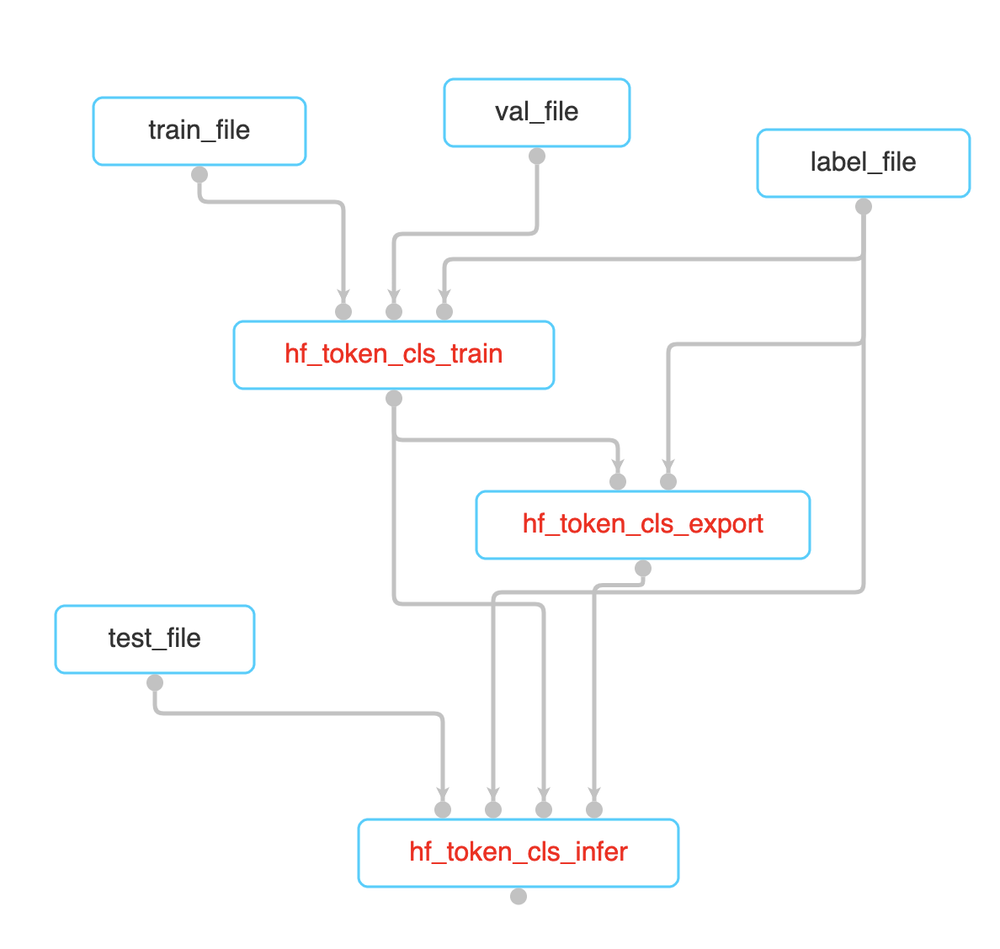

## 序列标注任务Pony插件使用指南
### 任务简介
该任务用于对一句话中的每个token做分类，包括了训练，导出和推理验证三个环节。

<table>
   <tr>
        <th >任务</th>
        <th>代码入口</th>
        <th width=60%>pony插件</th>
   </tr>
   <tr>
        <td>训练</td>
        <td>train.py</td>
   </tr>
   <tr>
        <td>导出</td>
        <td>export.py</td>
   </tr>
   <tr>
        <td>推理</td>
        <td>inference_with_onnx.py</td>
   </tr>
</table>
<br/>

### 使用说明
#### 1 构建数据集
数据集推荐有训练集，验证集和测试集三种，如果没有测试集，可以用验证集来代替测试集。

不管是哪种数据集，都需要导出成一个json文件，json的必要字段为

<table>
   <tr>
        <th >参数名称</th>
        <th>数据类型</th>
        <th width=60%>说明</th>
   </tr>
   <tr>
        <td>raw_str</td>
        <td>str</td>
        <td>原始的字符串</td>
   </tr>
   <tr>
        <td>ne</td>
        <td>list[dict]</td>
        <td>数据的标签</td>
   </tr>
   <tr>
        <td>ne.tag</td>
        <td>str</td>
        <td>数据的标签，必须要和label_list中的标签对应，"O"可以不标</td>
   </tr>
   <tr>
        <td>ne.offset</td>
        <td>int</td>
        <td>数据的标签对应于raw_str中的原始位置</td>
   </tr>
   <tr>
        <td>ne.length</td>
        <td>int</td>
        <td>数据的标签对应于raw_str中的长度</td>
   </tr>
</table>
<br/>

只有一条数据的示例：
```json
[
  {
    "raw_str": "毛泽东  是国家主席,他生于湖南长沙，没去过美国。",
    "ne":[
      {
        "tag": "PER",
        "offset": 0,
        "length": 3
      },
      {
        "tag": "GPE",
        "offset": 14,
        "length": 4
      },
      {
        "tag": "GPE",
        "offset": 22,
        "length": 2
      }
    ]
  }
]
```

数据集的真实例子可见：
```
data/conll2003/train_euler.json
data/conll2003/val_euler.json
data/conll2003/test_euler.json
```

同时，还需要一个标签文件来告诉模型有几个类别，以及类别的名称。这个文件就是一个每个类别名称为1行的文件。这里标签的行数就是标签的index，这个index需要和数据集中标签的序号对应。

示例：
```
O
PER
ORG
LOC
MISC
```

标签文件真实例子可见：
```
data/conll2003/label_euler.txt
```

#### 2训练pipeline

<div align="center">
    
    <br/>
    图2-1 训练pipeline
</div>


#### 3 参数

不同的数据集，需要修改train_file，val_file，test_file和label_file中的文件路径即可。

同时要修改每一个插件节点的输出路径，输出的结果都在输出路径当中，不设置的话，会被存到一个默认的临时文件夹下。

上述的五个参数是必须要修改的参数。

其余为可选参数：

（1）训练参数
<table>
   <tr>
        <th >参数名称</th>
        <th>数据类型</th>
        <th width=60%>说明</th>
   </tr>
   <tr>
        <td>model</td>
        <td>str</td>
        <td>用于分类任务的模型，默认为"distilbert"，可选的有["distilbert", "bert"]</td>
   </tr>
   <tr>
        <td>batch_size</td>
        <td>int</td>
        <td>训练时的batch_size</td>
   </tr>
   <tr>
        <td>epochs</td>
        <td>int</td>
        <td>训练模型的epochs</td>
   </tr>
</table>
<br/>

（2）导出参数
<table>
   <tr>
        <th >参数名称</th>
        <th>数据类型</th>
        <th width=60%>说明</th>
   </tr>
   <tr>
        <td>model</td>
        <td>str</td>
        <td>用于分类任务的模型，默认为"distilbert"，可选的有["distilbert", "bert"]</td>
   </tr>
</table>
<br/>

（3）推理参数
<table>
   <tr>
        <th >参数名称</th>
        <th>数据类型</th>
        <th width=60%>说明</th>
   </tr>
   <tr>
        <td>batch_size</td>
        <td>int</td>
        <td>训练时的batch_size</td>
   </tr>
</table>
<br/>

#### 4 运行

train和inference的文件都会输出四个指标，分别是

[accuracy_score](https://github.com/chakki-works/seqeval/blob/master/seqeval/metrics/sequence_labeling.py#L369)：所有token的预测正确的数量/所有token的预测错误的数量，包括了'O'

[precision_score](https://github.com/chakki-works/seqeval/blob/master/seqeval/metrics/sequence_labeling.py#L402)：所有token预测正确的数量/所有预测的数量，不包括'O'

[recall_score](https://github.com/chakki-works/seqeval/blob/master/seqeval/metrics/sequence_labeling.py#L491)：所有token预测正确的数量/所有真实的数量，不包括'O'

[f1_score](https://github.com/chakki-works/seqeval/blob/master/seqeval/metrics/sequence_labeling.py#L277)：precision和recall的综合指标，2 * (precision * recall) / (precision + recall)

#### 参考资料
[1] [https://huggingface.co/docs/transformers/tasks/token_classification](https://huggingface.co/docs/transformers/tasks/token_classification)

[2] [https://github.com/huggingface/transformers](https://github.com/huggingface/transformers)
